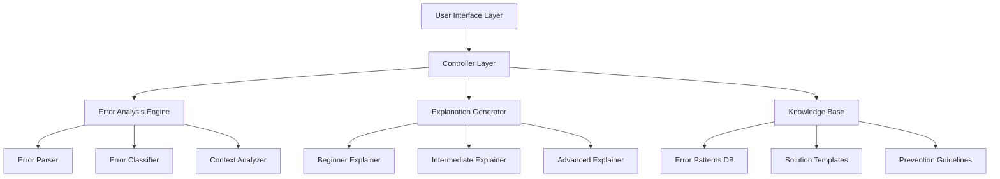

# Debug Mentor Design Document

## Overview

Debug Mentor is an AI-powered debugging assistant that operates entirely within Kiro to help developers understand, fix, and prevent programming errors. The system uses pattern matching, knowledge bases, and structured analysis to provide educational explanations at multiple complexity levels.

The design emphasizes educational value, helping developers not just solve immediate problems but grow their debugging skills over time. By operating within Kiro's ecosystem, the tool maintains full control over data processing and user experience while leveraging Kiro's built-in AI capabilities.

## Architecture

The system follows a layered architecture with clear separation of concerns:



### Core Components

1. **Error Analysis Engine**: Parses, classifies, and analyzes error inputs
2. **Explanation Generator**: Creates multi-level explanations based on analysis results
3. **Knowledge Base**: Stores error patterns, solutions, and educational content
4. **User Interface**: Provides intuitive interaction for error input and result display

## Components and Interfaces

### Error Analysis Engine

The Error Analysis Engine is responsible for understanding and categorizing error inputs.

**ErrorAnalysisEngine Interface:**
```typescript
interface ErrorAnalysisEngine {
  analyzeError(input: ErrorInput): Promise<ErrorAnalysis>
  classifyError(parsedError: ParsedError): ErrorClassification
  extractContext(input: ErrorInput): ContextInfo
}

interface ErrorInput {
  content: string
  timestamp: Date
  userLevel?: ExplanationLevel
}

interface ErrorAnalysis {
  classification: ErrorClassification
  rootCause: string
  context: ContextInfo
  severity: ErrorSeverity
  commonPatterns: string[]
}
```

**Error Parser Component:**
- Identifies error types (compilation, runtime, logical)
- Extracts key information (file names, line numbers, error codes)
- Handles various formats (stack traces, compiler output, log entries)
- Normalizes error information for consistent processing

**Error Classifier Component:**
- Categorizes errors by type (syntax, type, runtime, logic, etc.)
- Identifies programming language and framework context
- Determines error complexity and common occurrence patterns
- Maps errors to knowledge base entries

### Explanation Generator

The Explanation Generator creates educational content tailored to different skill levels.

**ExplanationGenerator Interface:**
```typescript
interface ExplanationGenerator {
  generateExplanation(analysis: ErrorAnalysis, level: ExplanationLevel): Explanation
  adaptComplexity(content: string, targetLevel: ExplanationLevel): string
  generateAnalogies(concept: string, level: ExplanationLevel): string[]
}

interface Explanation {
  whatItMeans: string
  whyItHappens: string
  howToFix: Solution[]
  prevention: PreventionGuidance
  level: ExplanationLevel
  educationalNotes: string[]
}

enum ExplanationLevel {
  BEGINNER = "beginner",
  INTERMEDIATE = "intermediate", 
  ADVANCED = "advanced"
}
```

**Level-Specific Explainers:**

*Beginner Explainer:*
- Uses simple language and everyday analogies
- Avoids technical jargon
- Focuses on practical steps
- Includes encouraging language

*Intermediate Explainer:*
- Uses technical terms with clear definitions
- Explains underlying concepts
- Provides multiple solution approaches
- Connects to broader programming principles

*Advanced Explainer:*
- Includes deep technical details
- Explains system-level behavior
- Discusses performance implications
- References language specifications and standards

### Knowledge Base

The Knowledge Base stores structured information about errors, solutions, and educational content.

**KnowledgeBase Interface:**
```typescript
interface KnowledgeBase {
  findErrorPattern(classification: ErrorClassification): ErrorPattern[]
  getSolutions(errorType: string): Solution[]
  getPreventionGuidance(errorType: string): PreventionGuidance
  updatePattern(pattern: ErrorPattern): void
}

interface ErrorPattern {
  id: string
  errorType: string
  commonCauses: string[]
  indicators: string[]
  languages: string[]
  frameworks: string[]
}

interface Solution {
  description: string
  steps: string[]
  codeExample?: string
  priority: number
  reasoning: string
}
```

**Data Organization:**
- Error patterns organized by language and error type
- Solution templates with priority rankings
- Prevention guidelines linked to error categories
- Educational content structured by complexity level

### User Interface Layer

The UI provides intuitive interaction for error input and result presentation.

**DebugMentorUI Interface:**
```typescript
interface DebugMentorUI {
  displayInputForm(): void
  processErrorInput(input: string): void
  displayExplanation(explanation: Explanation): void
  switchExplanationLevel(level: ExplanationLevel): void
}

interface UIComponents {
  errorInputArea: TextArea
  levelSelector: LevelSelector
  explanationDisplay: ExplanationDisplay
  solutionPanel: SolutionPanel
  preventionPanel: PreventionPanel
}
```

## Data Models

### Core Data Structures

**ErrorInput Model:**
```typescript
interface ErrorInput {
  content: string           // Raw error text
  timestamp: Date          // When error was submitted
  language?: string        // Detected programming language
  framework?: string       // Detected framework/library
  userLevel?: ExplanationLevel  // User's preferred level
}
```

**ErrorAnalysis Model:**
```typescript
interface ErrorAnalysis {
  id: string
  input: ErrorInput
  classification: ErrorClassification
  parsedElements: ParsedError
  rootCause: string
  context: ContextInfo
  confidence: number       // Analysis confidence score
  relatedPatterns: string[]
}

interface ParsedError {
  errorType: string
  message: string
  location?: FileLocation
  stackTrace?: StackFrame[]
  errorCode?: string
}

interface FileLocation {
  filename: string
  lineNumber?: number
  columnNumber?: number
}
```

**Explanation Model:**
```typescript
interface Explanation {
  id: string
  analysisId: string
  level: ExplanationLevel
  sections: ExplanationSection[]
  generatedAt: Date
  estimatedReadTime: number
}

interface ExplanationSection {
  type: SectionType
  title: string
  content: string
  codeExamples?: CodeExample[]
  analogies?: string[]
}

enum SectionType {
  WHAT_IT_MEANS = "what_it_means",
  WHY_IT_HAPPENS = "why_it_happens", 
  HOW_TO_FIX = "how_to_fix",
  PREVENTION = "prevention",
  LEARNING_NOTES = "learning_notes"
}
```

### Knowledge Base Schema

**Error Pattern Storage:**
```typescript
interface ErrorPatternDB {
  patterns: Map<string, ErrorPattern>
  solutions: Map<string, Solution[]>
  preventionGuidelines: Map<string, PreventionGuidance>
  educationalContent: Map<string, EducationalContent>
}

interface EducationalContent {
  concept: string
  beginnerExplanation: string
  intermediateExplanation: string
  advancedExplanation: string
  analogies: Analogy[]
  relatedConcepts: string[]
}
```

## Implementation Strategy

### Kiro Integration Approach

Since Debug Mentor must operate entirely within Kiro without external AI services, the implementation leverages:

1. **Kiro's Built-in AI Capabilities**: Use Kiro's internal AI for natural language processing and explanation generation
2. **Pattern Matching Systems**: Implement rule-based error classification using regex and structured patterns
3. **Template-Based Generation**: Create explanation templates that can be dynamically filled based on error analysis
4. **Knowledge Base Integration**: Store error patterns and solutions in Kiro's internal data structures

### Error Processing Pipeline

1. **Input Validation**: Verify error input contains recognizable patterns
2. **Parsing**: Extract structured information from unstructured error text
3. **Classification**: Categorize error type and determine appropriate knowledge base entries
4. **Analysis**: Generate root cause analysis and context information
5. **Explanation Generation**: Create level-appropriate explanations using templates and AI assistance
6. **Solution Ranking**: Prioritize solutions based on error context and user level
7. **Prevention Guidance**: Generate educational content to prevent similar errors

### Multi-Level Explanation Strategy

**Template-Based Approach:**
- Create explanation templates for each error type and level
- Use Kiro's AI to adapt language complexity and generate analogies
- Maintain consistency while allowing for dynamic content generation

**Content Adaptation Rules:**
- Beginner: Simple vocabulary, concrete examples, step-by-step guidance
- Intermediate: Technical accuracy with clear explanations, multiple approaches
- Advanced: Comprehensive technical details, system-level insights, optimization considerations

## Correctness Properties

*A property is a characteristic or behavior that should hold true across all valid executions of a system—essentially, a formal statement about what the system should do. Properties serve as the bridge between human-readable specifications and machine-verifiable correctness guarantees.*

Based on the requirements analysis, the following properties ensure Debug Mentor operates correctly across all inputs and scenarios:

### Property 1: Error Input Processing
*For any* text input containing error messages, stack traces, or log entries, the system should successfully accept and process the input while preserving its original formatting.
**Validates: Requirements 1.1, 1.4**

### Property 2: Input Validation
*For any* input text, the system should correctly distinguish between valid error information and invalid/empty input, returning appropriate responses for each case.
**Validates: Requirements 1.2, 1.3**

### Property 3: Explanation Level Switching
*For any* error analysis, users should be able to switch between all three explanation levels (Beginner, Intermediate, Advanced) and receive different content for each level.
**Validates: Requirements 2.1, 2.5, 8.3**

### Property 4: Complete Error Analysis
*For any* valid error input, the generated analysis should include root cause explanation, specific code patterns or conditions that trigger the error, and contextual information about when/where the error typically occurs.
**Validates: Requirements 3.2, 3.3, 3.4**

### Property 5: Complete Solution Guidance
*For any* error analysis, the system should provide actionable steps to fix the error, include reasoning for each solution, and provide code examples when applicable.
**Validates: Requirements 4.1, 4.3, 4.4**

### Property 6: Solution Priority Ordering
*For any* error analysis with multiple solutions, the solutions should be presented in order of recommended priority with higher-priority solutions appearing first.
**Validates: Requirements 4.2**

### Property 7: Complete Prevention Guidance
*For any* error analysis, the system should provide prevention guidance that includes coding practices/patterns/tools, underlying principles for robust code, and specific debugging techniques relevant to the error type.
**Validates: Requirements 5.1, 5.2, 5.3, 5.4**

### Property 8: Educational Content Integration
*For any* error explanation, the content should connect specific errors to broader programming concepts and explain why solutions work, not just what to do.
**Validates: Requirements 6.2, 6.3**

### Property 9: Kiro-Native Operation
*For any* system operation, the Debug Mentor should use only Kiro's built-in capabilities, maintain all data within Kiro system boundaries, and make no external API calls or use external storage mechanisms.
**Validates: Requirements 7.1, 7.2, 7.3, 7.4**

## Error Handling

The system implements comprehensive error handling across all components:

### Input Processing Errors
- **Invalid Format**: When error input doesn't match recognizable patterns, return educational guidance on what constitutes valid error information
- **Empty Input**: Provide helpful prompts and examples of valid error inputs
- **Parsing Failures**: Gracefully handle malformed stack traces or incomplete error messages

### Analysis Engine Errors
- **Classification Failures**: When error type cannot be determined, provide general debugging guidance
- **Knowledge Base Misses**: When specific error patterns aren't found, fall back to general error category guidance
- **Context Extraction Failures**: Continue with available information and note limitations

### Explanation Generation Errors
- **Template Failures**: Fall back to basic explanation structure when advanced templates fail
- **Level Adaptation Errors**: Provide default explanation level when adaptation fails
- **Content Generation Issues**: Ensure minimum viable explanation is always provided

### System Integration Errors
- **Kiro API Failures**: Implement retry logic and graceful degradation
- **Storage Errors**: Handle data persistence failures without losing user session
- **Performance Issues**: Implement timeouts and progress indicators for long-running analyses

## Testing Strategy

Debug Mentor employs a dual testing approach combining unit tests for specific scenarios and property-based tests for comprehensive coverage.

### Unit Testing Focus
Unit tests validate specific examples and edge cases:
- **Error Pattern Recognition**: Test parsing of common error formats (compilation errors, runtime exceptions, stack traces)
- **Explanation Quality**: Verify explanation templates produce expected content structure
- **UI Component Behavior**: Test interface interactions and level switching
- **Integration Points**: Validate component interactions and data flow

### Property-Based Testing Focus
Property tests verify universal correctness across all inputs:
- **Input Processing**: Generate diverse error inputs to test parsing robustness
- **Content Completeness**: Verify all required explanation components are present
- **Level Consistency**: Ensure explanation levels maintain appropriate complexity differences
- **System Constraints**: Validate Kiro-native operation across all scenarios

### Testing Configuration
- **Minimum 100 iterations** per property test to ensure comprehensive input coverage
- **Property test tags** reference design document properties: **Feature: debug-mentor, Property {number}: {property_text}**
- **Error input generators** create realistic error messages, stack traces, and log entries
- **Content validators** verify explanation structure and completeness
- **Integration tests** validate end-to-end user workflows

### Test Data Strategy
- **Synthetic Error Generation**: Create realistic error patterns for various programming languages
- **Real-World Error Corpus**: Collect anonymized error examples for testing
- **Edge Case Coverage**: Test boundary conditions, malformed inputs, and unusual error formats
- **Performance Testing**: Validate response times and resource usage under load

The testing strategy ensures Debug Mentor provides reliable, educational debugging assistance while maintaining high performance and user experience standards.